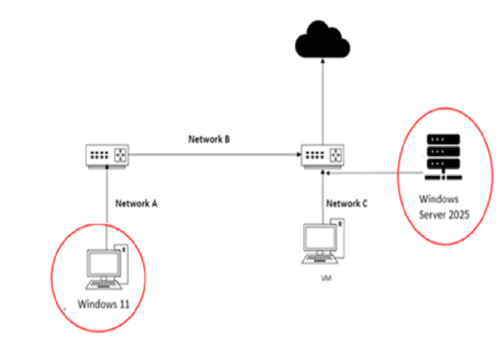

# Active Directory (AD) and Kerberos Authentication

> **Windows Server 2025** • **Active Directory Domain Services (AD DS)** • **DNS** • **Kerberos** • **LDAP** • **IIS** • **Wireshark**


## Lab Overview

This laboratory demonstrates the deployment of a complete Microsoft Active Directory environment using Windows Server 2025. The project includes the installation and configuration of Active Directory Domain Services (AD DS), DNS, domain administration, Windows client integration, Kerberos authentication, IIS integration, and packet-level analysis of the Kerberos protocol using Wireshark.


## Objective

The objective of this laboratory is to deploy a Windows Server 2025 Active Directory environment, join a Windows client to the domain, verify Kerberos authentication, and configure Kerberos-based authentication for an IIS web service.


## Network Topology

The laboratory environment consists of a Windows Server 2025 Domain Controller, a Windows 11 client, network infrastructure, and an additional virtual machine connected through separate network segments.




## Introduction

**Active Directory (AD)** is Microsoft's directory service for centrally storing and managing information about network resources. These resources are represented as objects, including users, computers, groups, printers, servers, and shared resources.

Active Directory organizes objects within a hierarchical structure. An **Organizational Unit (OU)** is a logical container used to group related objects inside a domain. OUs simplify administration and allow management responsibilities to be delegated without granting administrative privileges over the entire domain.

Active Directory organizes information using three logical levels:

- **Domain** — a collection of Active Directory objects sharing a common directory database, namespace, and security policies.
- **Tree** — one or more related domains sharing a contiguous namespace.
- **Forest** — one or more Active Directory trees sharing a common schema, configuration, and Global Catalog.

In addition to directory services, Active Directory provides:

- centralized authentication and authorization;
- Group Policy management;
- Single Sign-On (SSO);
- Lightweight Directory Access Protocol (LDAP);
- certificate services (AD CS);
- integration with Kerberos authentication.


## Domain Controller

A **Domain Controller (DC)** is a Windows Server hosting **Active Directory Domain Services (AD DS)**.

Its primary responsibilities include:

- maintaining the Active Directory database;
- authenticating users and computers;
- authorizing access to network resources;
- applying Group Policies;
- providing directory services to clients.

Without a Domain Controller, Active Directory cannot function as a centralized identity management system.


## Kerberos Authentication

Kerberos is the default authentication protocol used in Active Directory environments.

Its primary advantages include:

- passwords are never transmitted across the network;
- mutual authentication between client and server;
- Single Sign-On (SSO);
- encrypted tickets instead of repeated credential exchange.

Kerberos relies on a **Key Distribution Center (KDC)** hosted on the Domain Controller.

The KDC consists of two logical services:

- **Authentication Service (AS)** — authenticates the user and issues a **Ticket Granting Ticket (TGT)**.
- **Ticket Granting Service (TGS)** — issues service tickets that allow authenticated users to access network services.

This ticket-based authentication mechanism improves security by eliminating the need to transmit user passwords across the network.


## Security Perspective

Understanding Kerberos is essential for both Windows administration and cybersecurity because it is the primary authentication protocol used in Active Directory environments.

Knowledge gained in this laboratory provides the foundation for understanding attacks such as:

- Kerberoasting
- Pass-the-Ticket
- Golden Ticket
- Silver Ticket
- Overpass-the-Hash


## Technologies

- Windows Server 2025
- Active Directory Domain Services (AD DS)
- DNS
- LDAP
- Kerberos
- IIS
- Wireshark


## Skills Demonstrated

- Active Directory deployment
- Domain Controller administration
- DNS configuration
- Organizational Unit (OU) management
- User and computer administration
- Windows Domain Join
- Kerberos authentication
- IIS Windows Authentication
- Network packet analysis using Wireshark


## Repository Structure

```text
06-active-directory-kerberos/
│
├── README.md
├── configs/
├── diagrams/
├── docs/
│   ├── install-configure-server.md
│   ├── domain-join.md
│   ├── kerberos-authentication.md
│   └── iis-kerberos.md
└── evidence/
```


## Laboratory Parts

| Part | Documentation |
|------|---------------|
| **Part I** | [Install and Configure Windows Server 2025, Active Directory Domain Services (AD DS), DNS, Domain Controller, Organizational Units, Users, and DNS Records](docs/install-configure-server.md) |
| **Part II** | [Configure Windows Client and Join the Active Directory Domain](docs/domain-join.md) |
| **Part III** | [Analyze Kerberos User Authentication](docs/kerberos-authentication.md) |
| **Part IV** | [Configure IIS Integrated Windows Authentication Using Kerberos](docs/iis-kerberos.md) |


## References

Axway. (n.d.). *Wireshark tracing for Kerberos.* https://docs.axway.com/

Microsoft. (n.d.). *Evaluate Windows Server.* https://www.microsoft.com/en-us/evalcenter/evaluate-windows-server

Microsoft. (n.d.). *Kerberos authentication overview.* https://learn.microsoft.com/en-us/windows-server/security/kerberos/kerberos-authentication-overview

Microsoft. (n.d.). *Windows Server documentation.* https://learn.microsoft.com/windows-server/

Microsoft. (n.d.). *Configuring Kerberos over IP.* https://learn.microsoft.com/en-us/windows-server/security/kerberos/configuring-kerberos-over-ip

MiniOrange. (n.d.). *Steps to Set Up Kerberos Windows Authentication.* https://plugins.miniorange.com/steps-setup-kerberos-windows-authentication