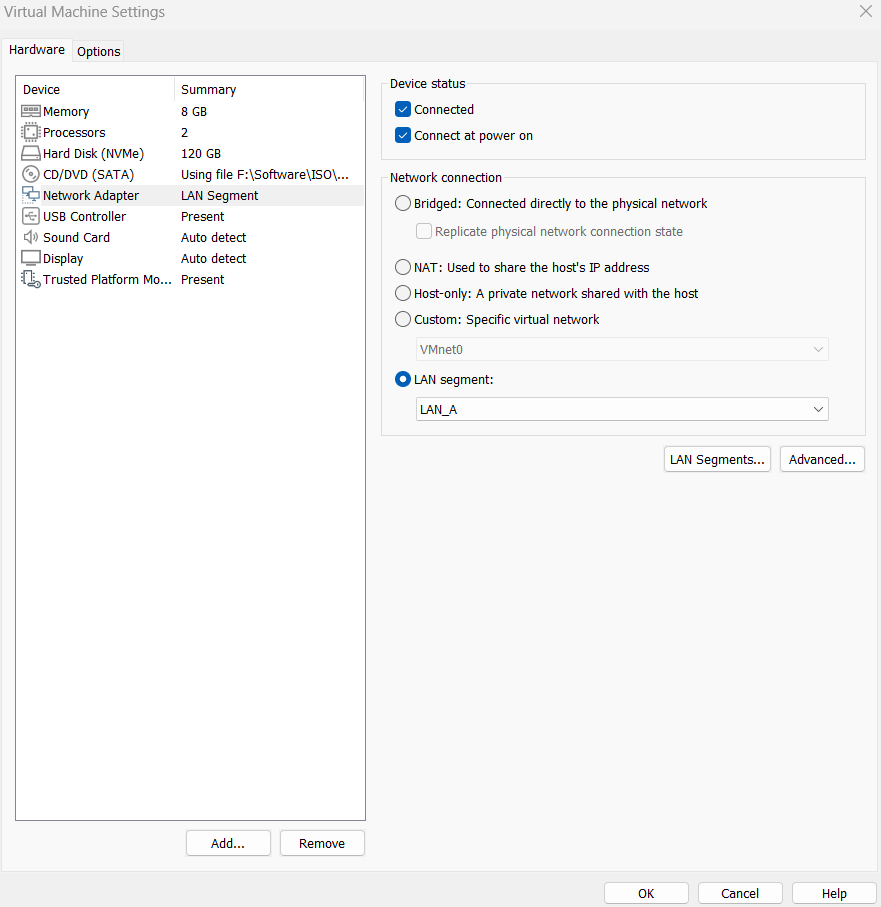
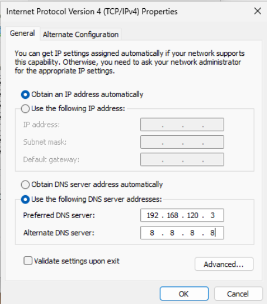
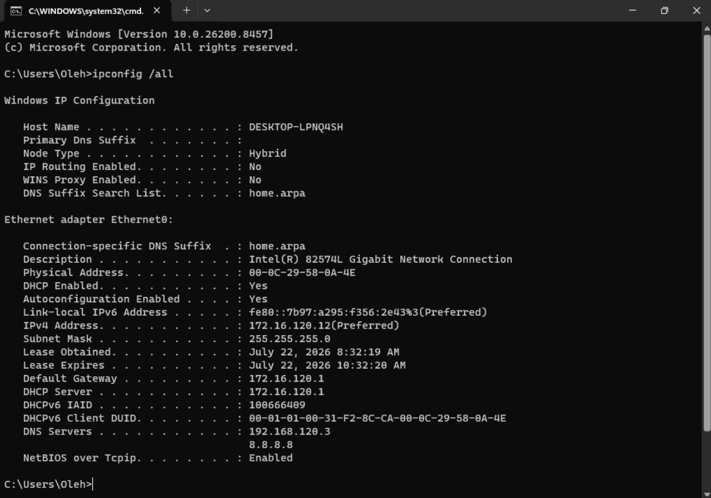
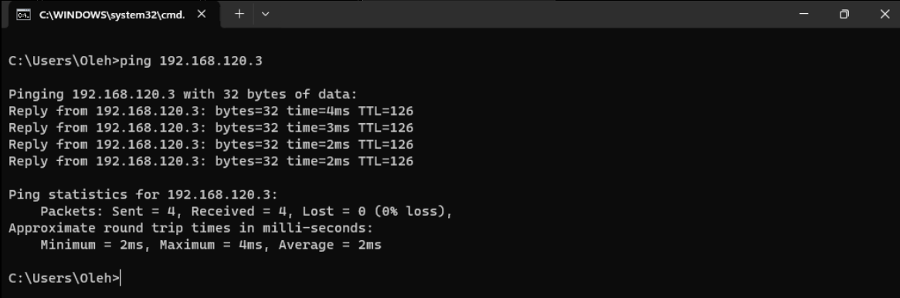
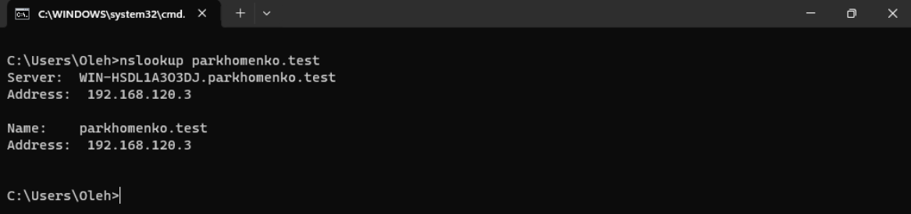
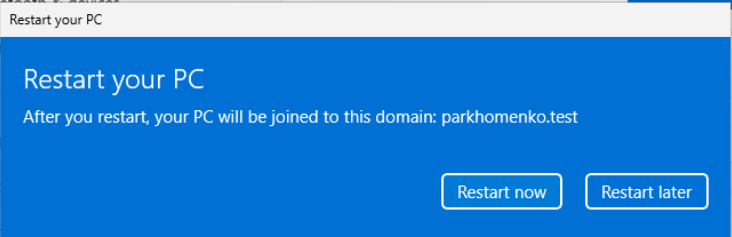
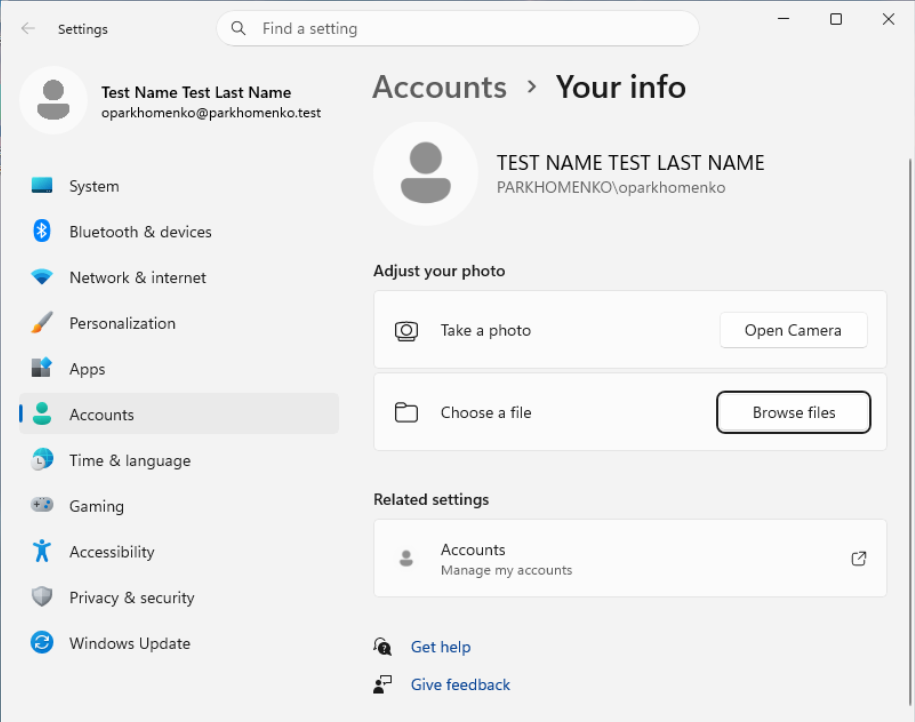
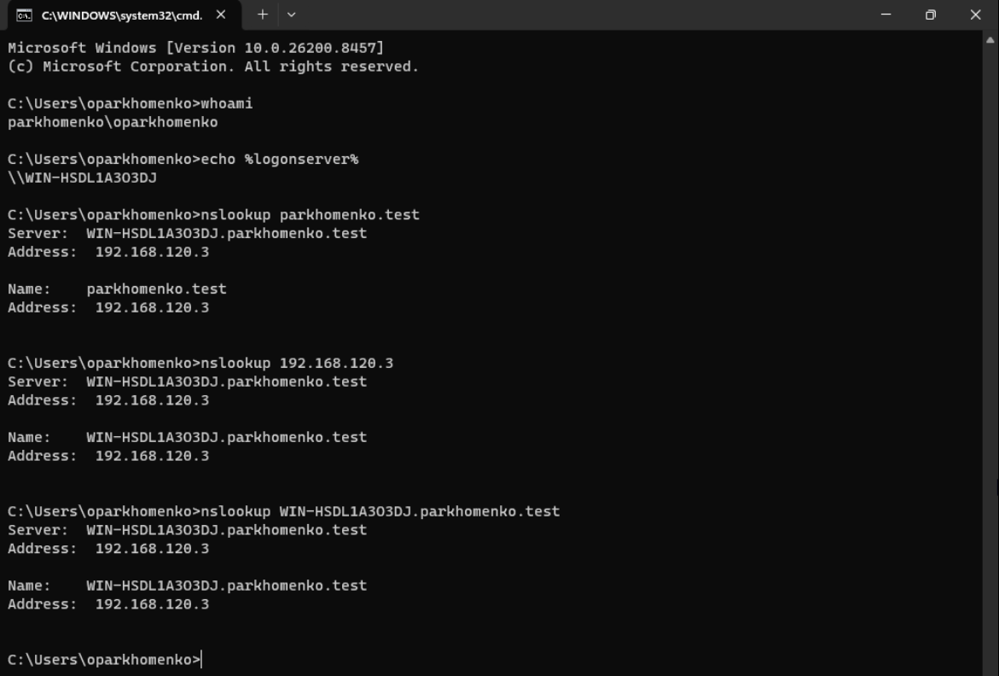
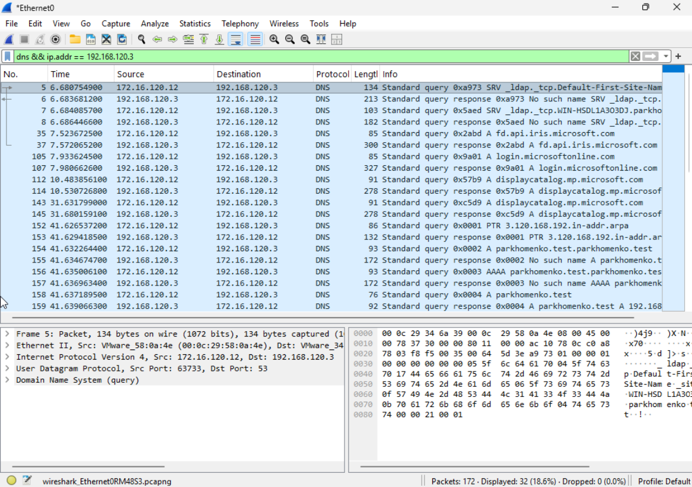

# Configure Windows Client and Join the Active Directory Domain

## Overview

In this part of the laboratory, a Windows 11 client was connected to the internal laboratory network and configured to use the Active Directory Domain Controller as its primary DNS server. The client obtained its IPv4 configuration automatically from the pfSense DHCP server while using the Domain Controller for name resolution. After verifying network connectivity and DNS functionality, the workstation was joined to the **parkhomenko.test** Active Directory domain. Finally, domain authentication, DNS name resolution, and DNS traffic were verified using Windows command-line tools and Wireshark.

## Configure Windows 11 Network Settings

The Windows 11 virtual machine was connected to the internal laboratory network using the VMware LAN Segment that provides access to the pfSense firewall and the Active Directory environment.

**Figure 25.** Windows 11 virtual machine connected to the internal laboratory network.



The client was configured to obtain its IPv4 address automatically from the pfSense DHCP server. The preferred DNS server was manually configured to use the Active Directory Domain Controller (**192.168.120.3**), while the alternate DNS server (**8.8.8.8**) was configured according to the laboratory requirements.

**Figure 26.** Windows 11 IPv4 configuration using DHCP and the Domain Controller as the preferred DNS server.



## Verify Network Configuration

The network configuration was verified using the `ipconfig /all` command.

The output confirmed:

- IPv4 address obtained automatically from the pfSense DHCP server
- Default gateway assigned by pfSense
- Preferred DNS server configured as **192.168.120.3**
- Alternate DNS server configured as **8.8.8.8**

**Figure 27.** Verification of the Windows 11 network configuration.



Connectivity between the Windows client (**172.16.120.12**) and the Domain Controller was verified using ICMP.

Successful replies confirmed that routing between the client subnet and the Domain Controller network was functioning correctly.

**Figure 28.** Successful connectivity test to the Domain Controller.



DNS name resolution was verified before joining the domain.

The Active Directory DNS server successfully resolved the **parkhomenko.test** domain name.

**Figure 29.** DNS name resolution verified using `nslookup`.



## Join Windows 11 to the Active Directory Domain

The Windows client was joined to the **parkhomenko.test** Active Directory domain using the **Join this device to a local Active Directory domain** option available under **Settings → Accounts → Access work or school**.

After successful authentication, Windows confirmed that the workstation had successfully joined the domain and required a restart.

**Figure 30.** Windows 11 successfully joined the Active Directory domain.



## Log in Using a Domain User Account

After restarting the workstation, the user successfully logged on using the standard Active Directory account created during Part I of the laboratory.

The account information confirms that the user is authenticated through the **parkhomenko.test** domain.

**Figure 31.** Successful logon using an Active Directory domain user account.



## Verify Domain Authentication

The domain authentication and DNS configuration were verified using Windows command-line tools.

The following commands were executed:

```cmd
whoami
echo %logonserver%
nslookup parkhomenko.test
nslookup 192.168.120.3
nslookup WIN-HSDL1A303DJ.parkhomenko.test
```

The output confirmed:

- successful domain authentication
- the Domain Controller acting as the logon server
- correct forward DNS resolution
- correct reverse DNS resolution
- successful hostname resolution of the Domain Controller

**Figure 32.** Verification of Active Directory authentication and DNS configuration.



## Verify DNS Traffic Using Wireshark

Wireshark was used to capture and analyze DNS traffic generated by the Windows client.

Packet capture was started before executing DNS queries from the command prompt. The capture shows DNS requests sent from the Windows client (**172.16.120.12**) to the Active Directory DNS server (**192.168.120.3**) together with the corresponding DNS responses.

The capture includes successful resolution of:

- `parkhomenko.test`
- `WIN-HSDL1A303DJ.parkhomenko.test`

The capture also contains additional **AAAA** and **PTR** queries automatically generated by the Windows DNS Client service, which is normal behavior during DNS name resolution.

**Figure 33.** Wireshark capture showing DNS queries and responses between the Windows client and the Active Directory DNS server.



## Summary

The Windows 11 client was successfully integrated into the **parkhomenko.test** Active Directory domain. Network connectivity, DHCP configuration, DNS name resolution, domain authentication, and DNS packet exchange were successfully verified. The environment is now ready for Kerberos authentication analysis in the next part of the laboratory.