# Configure Kerberos for Web IIS Service Authentication

## Objective

Configure Microsoft Internet Information Services (IIS) to use Kerberos authentication with Active Directory and verify the authentication process using Wireshark.

## Install and Configure IIS

The **Web Server (IIS)** role was installed using **Server Manager → Add Roles and Features**.

During installation, the **Windows Authentication** role service was selected.

> Figure 54. Windows Authentication role service selected during IIS installation.

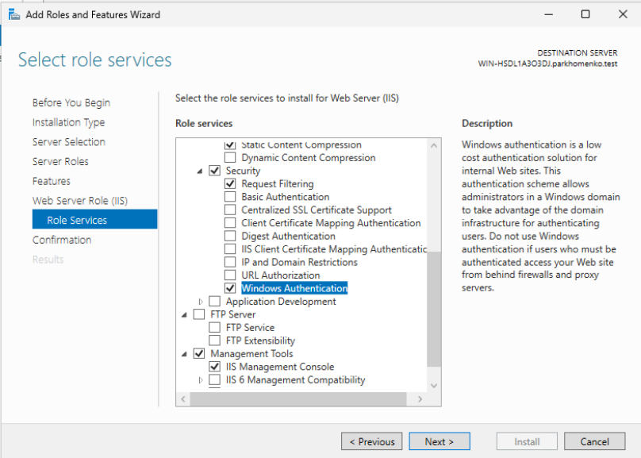

> Figure 55. IIS installation completed successfully.

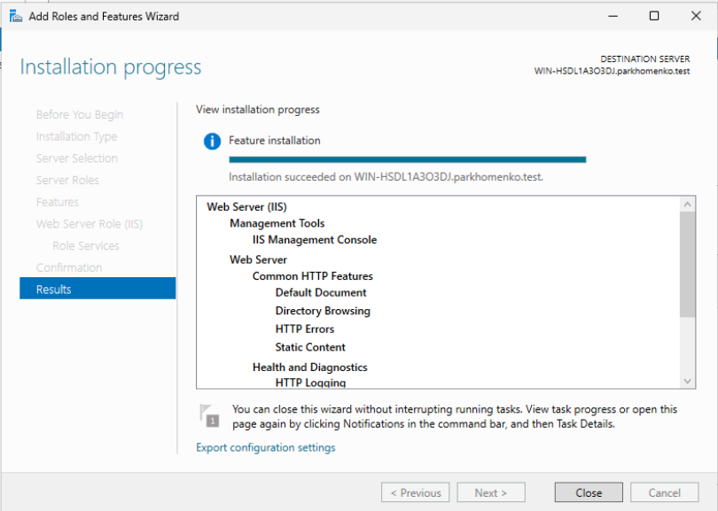

> Figure 56. IIS Manager showing the Default Web Site after installation.

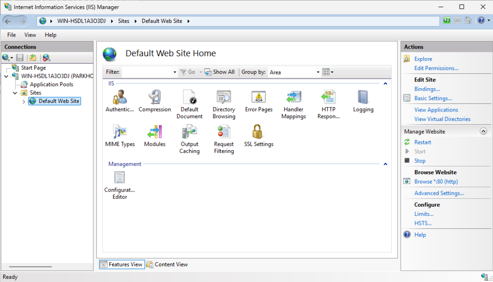

> Figure 57. Default IIS website successfully loaded before Windows Authentication was configured.

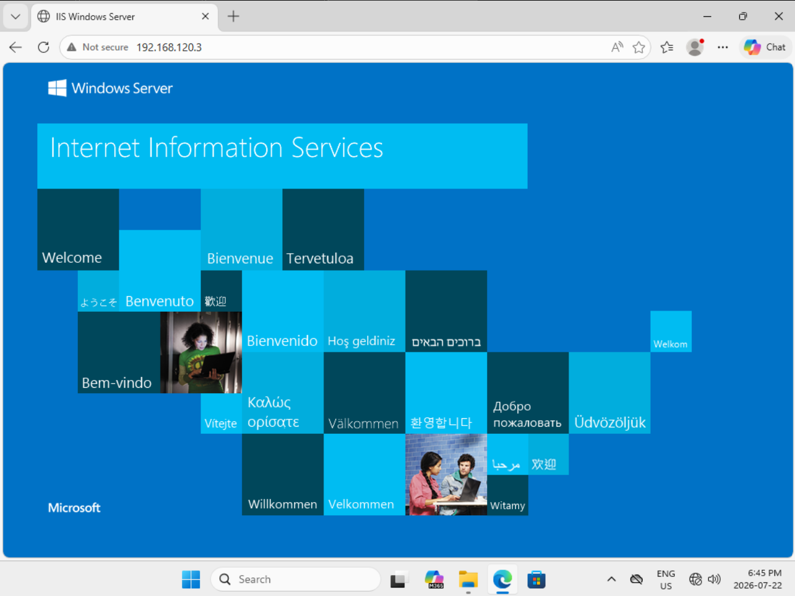  

## Configure Windows Authentication

The authentication settings for the **Default Web Site** were configured in IIS Manager.

Configuration:

- Anonymous Authentication → **Disabled**
- Windows Authentication → **Enabled**

This configuration requires users to authenticate using Windows credentials before accessing the website.

> Figure 58. Windows Authentication enabled and Anonymous Authentication disabled.

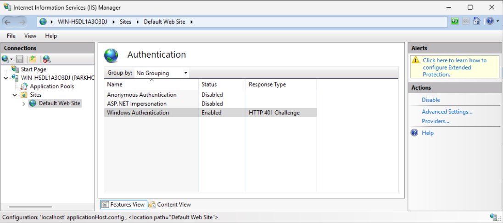  

## Configure Authentication Providers

The Windows Authentication providers were configured.

Provider order:

1. Negotiate
2. NTLM

Placing **Negotiate** first ensures IIS attempts Kerberos authentication before falling back to NTLM.

> Figure 59. Windows Authentication providers configured.

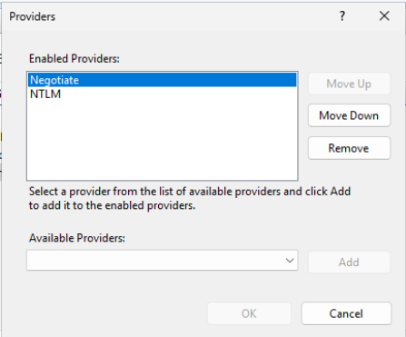

## Create IIS Service Account

A dedicated Active Directory service account was created for IIS.

Configuration:

| Setting | Value |
|---------|-------|
| Full Name | HTTP Service |
| User Logon Name | http |
| Password Never Expires | Enabled |

> Figure 60. HTTP service account created.

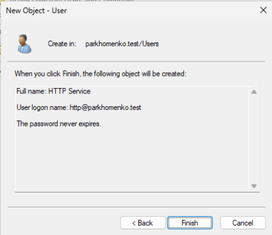  

> Figure 61. HTTP service account properties.  
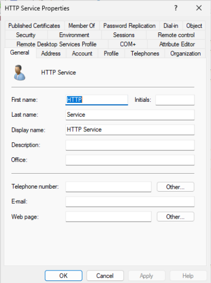    
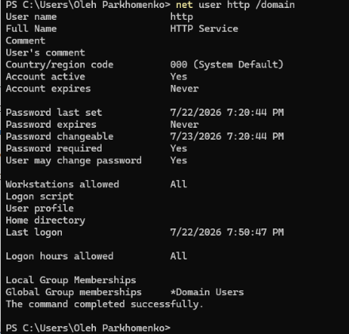

## Register Service Principal Names (SPNs)

The required HTTP SPNs were registered for the IIS service account.

```powershell
setspn -S HTTP/WIN-HSDL1A303DJ http
setspn -S HTTP/WIN-HSDL1A303DJ.parkhomenko.test http
```

The configuration was verified using:

```powershell
setspn -L http
```

Registered SPNs:

```text
HTTP/WIN-HSDL1A303DJ
HTTP/WIN-HSDL1A303DJ.parkhomenko.test
```

> Figure 62. HTTP Service Principal Names successfully registered.  
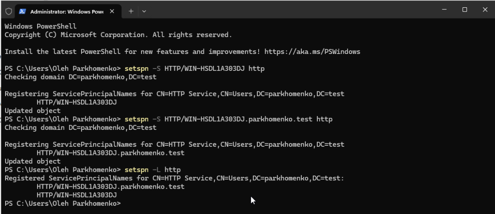

## Configure IIS Application Pool

The **DefaultAppPool** initially used the default **ApplicationPoolIdentity**.

The identity was then changed to the dedicated Active Directory service account:

```text
http@parkhomenko.test
```

The IIS configuration was updated to use the application pool credentials for Kerberos authentication.

```powershell
Import-Module WebAdministration

Set-WebConfigurationProperty `
-Filter "system.webServer/security/authentication/windowsAuthentication" `
-PSPath "IIS:\" `
-Location "Default Web Site" `
-Name "useAppPoolCredentials" `
-Value True

iisreset
```

> Figure 63. Default Application Pool identity before configuration.

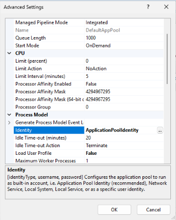

> Figure 64. Application Pool configured to use the HTTP service account.

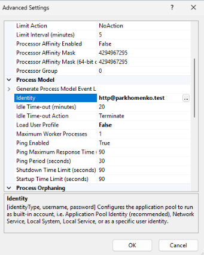

> Figure 65. Application Pool credentials enabled for Kerberos authentication.

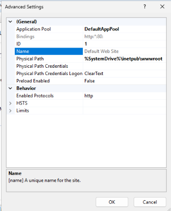

> Figure 66. IIS successfully restarted after configuration.

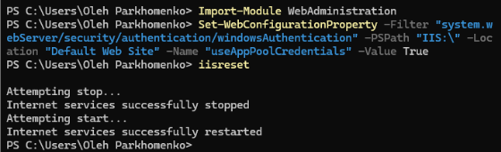  

## Verify DNS Resolution

Before testing Kerberos authentication, DNS resolution was verified from the Windows 11 client.

The client successfully resolved the Fully Qualified Domain Name (FQDN) of the IIS server.

> Figure 67. DNS host record configured on the Domain Controller.

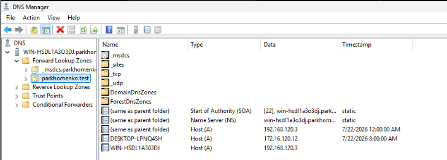

> Figure 68. Successful DNS name resolution using nslookup.

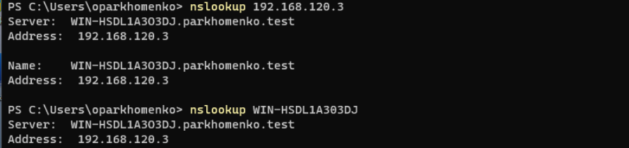

> Figure 69. Windows 11 client IP configuration.

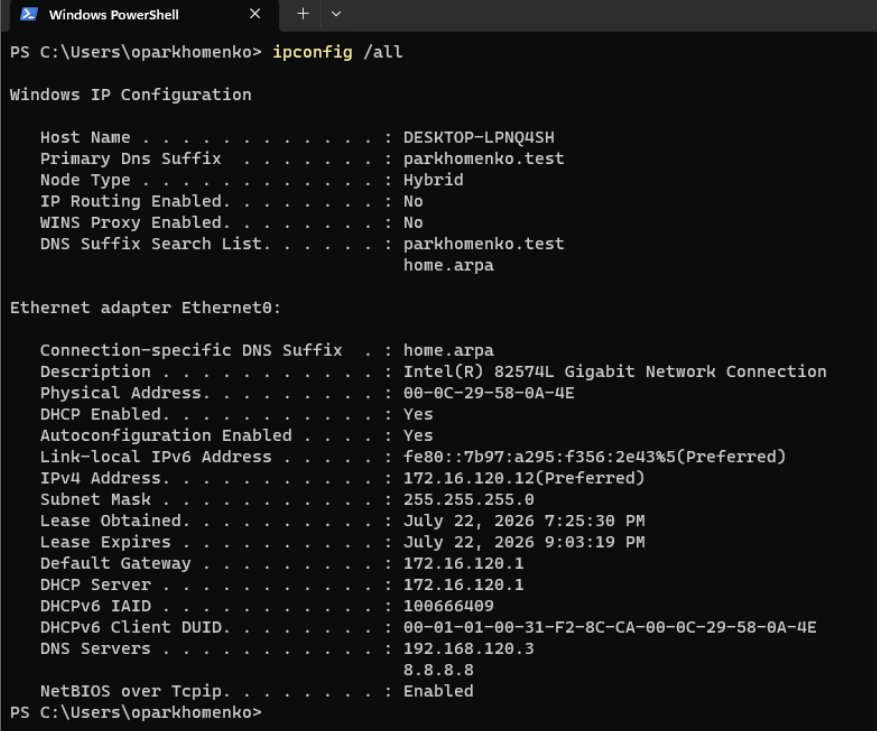  

## Verify IIS Authentication

The Windows 11 client accessed the IIS website using its Fully Qualified Domain Name (FQDN):

```text
http://WIN-HSDL1A303DJ.parkhomenko.test
```

Windows Authentication prompted for domain credentials.

After successful authentication, the IIS website loaded successfully.

> Figure 70. Windows Authentication credential prompt.

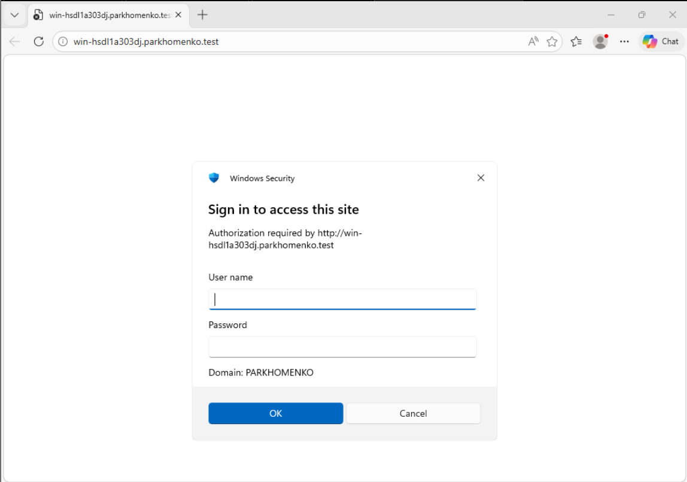

> Figure 71. IIS website successfully accessed after authentication.

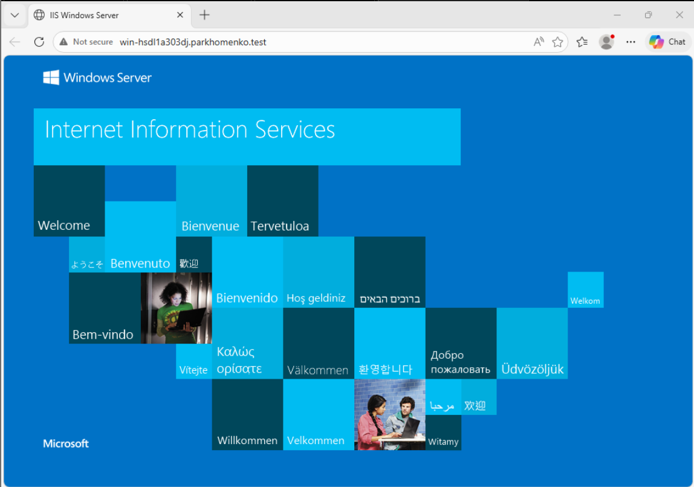  

## Verify Kerberos Authentication Using Wireshark

A packet capture was performed on the Windows 11 client using Wireshark.

Display filters:

```text
kerberos
```

and

```text
tcp.port == 88
```

The capture contains Kerberos authentication traffic between the client and the Domain Controller.

Observed Kerberos packets:

- TGS-REQ
- TGS-REP

These packets confirm that the client requested and received a Kerberos service ticket from the Key Distribution Center (KDC).

The Kerberos ticket cache was cleared using:

```cmd
klist purge
```

Although `klist` did not display cached tickets in this lab environment after the purge, the successful authentication to the IIS website together with the captured **TGS-REQ** and **TGS-REP** packets confirms that Kerberos authentication was successfully performed.

> Figure 72. Wireshark capture filtered using `kerberos`.

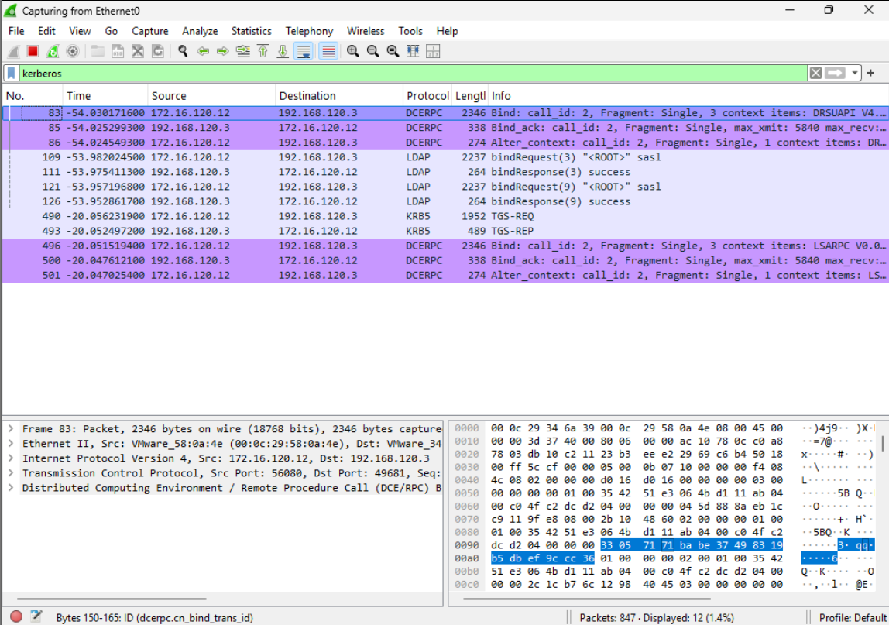

> Figure 73. Kerberos ticket cache cleared using `klist purge`.

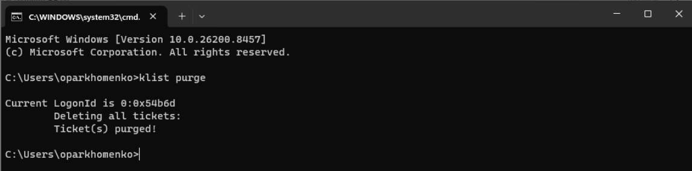

# Result

Kerberos authentication for the IIS web service was successfully configured.

Windows Authentication was enabled for the Default Web Site, with **Negotiate** configured as the preferred authentication provider. A dedicated Active Directory service account was created, HTTP Service Principal Names (SPNs) were registered, and the IIS Application Pool was configured to use the service account credentials. DNS resolution using the Fully Qualified Domain Name (FQDN) was successfully verified before authentication testing. The Windows 11 client authenticated successfully to the IIS website, and Wireshark confirmed Kerberos authentication by capturing **TGS-REQ** and **TGS-REP** messages exchanged between the client and the Domain Controller.