# Analyze Kerberos User Authentication

## Overview

In this part of the laboratory, Kerberos authentication in an Active Directory domain was analyzed using Wireshark. Network traffic was captured while a Windows 11 client logged on with a domain user account. The Authentication Service (AS) exchange, Ticket Granting Service (TGS) exchange, and LDAP authentication packets were examined to understand how Active Directory authenticates users and grants access to network services.

The Kerberos ticket cache on the Windows 11 client was also verified using the `klist` command. Finally, the built-in `krbtgt` account was examined in Active Directory Users and Computers to understand its role in the Kerberos authentication process.

## Capture Kerberos Authentication Traffic

Wireshark was installed on the Windows Server 2025 Domain Controller. After installation, the **Ethernet0** network interface was selected because it was connected to the internal Active Directory laboratory network.

**Figure 34.** Wireshark displaying the available network interfaces.

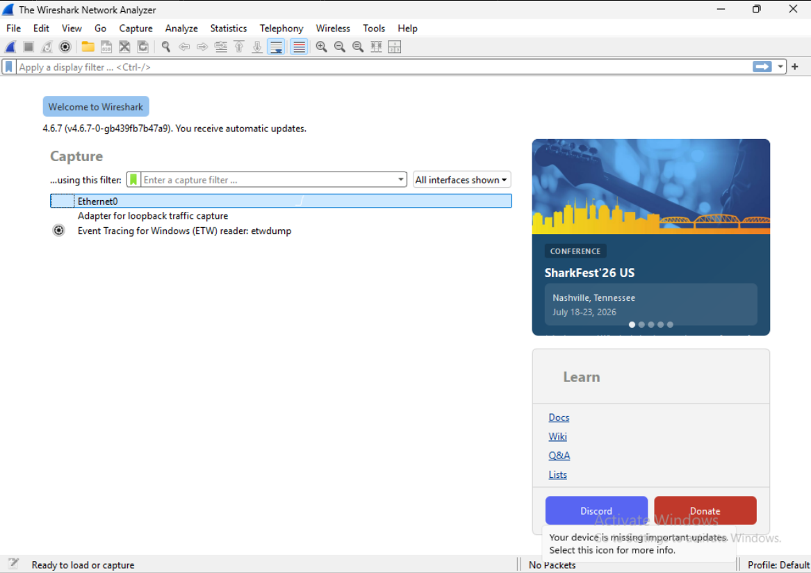

Packet capture was started on the **Ethernet0** interface before the Windows 11 client performed a new domain logon. Capturing traffic before authentication ensured that the complete Kerberos exchange was recorded.

**Figure 35.** Packet capture running on the Ethernet0 interface.

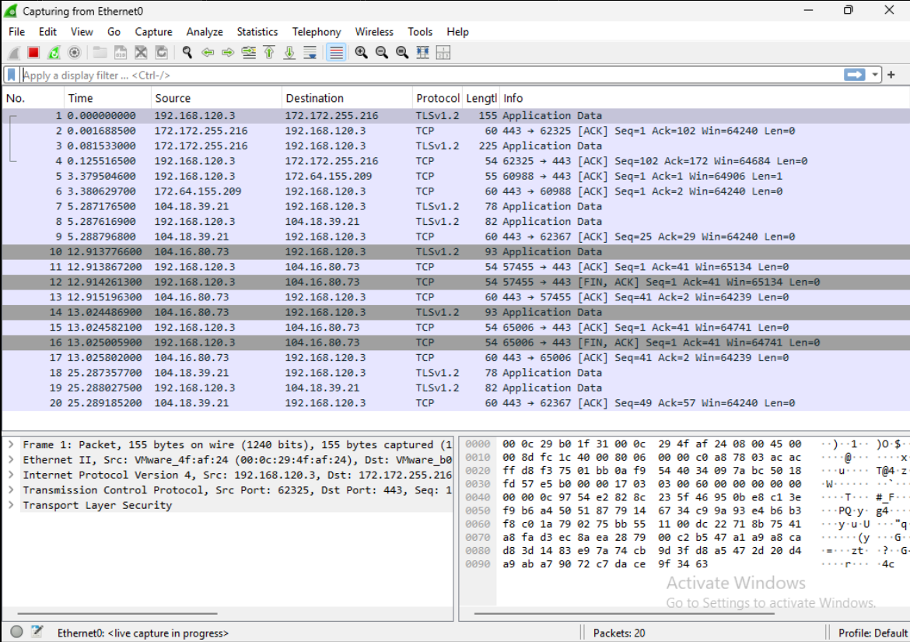

## Log On Using a Domain User Account

While Wireshark continued capturing traffic, the Windows 11 client signed in using the Active Directory domain account created in the previous part of the laboratory.

| Setting | Value |
| :--- | :--- |
| Domain | `parkhomenko.test` |
| Username | `oparkhomenko` |

During the logon process, the client contacted the Domain Controller and performed Kerberos authentication. LDAP communication with Active Directory was also generated. Both protocols were successfully captured in Wireshark.

**Figure 36.** Kerberos and LDAP packets captured during the Windows 11 domain logon.

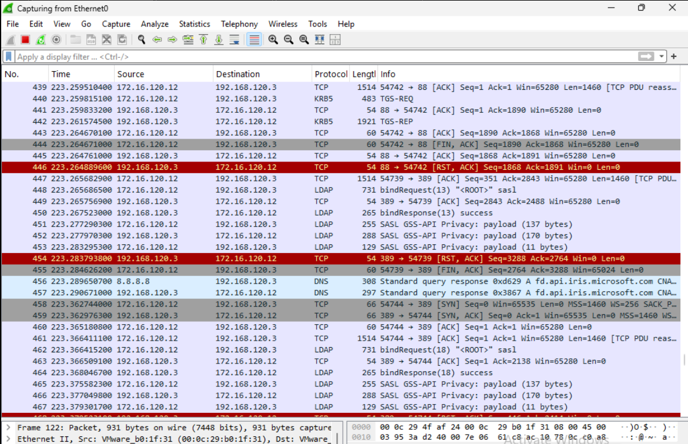

## Filter Kerberos Traffic

The Kerberos packets were isolated using the following Wireshark display filter:

```text
kerberos
```

The filtered capture displayed the complete Kerberos authentication sequence, including:

- `AS-REQ`
- `KRB5KDC_ERR_PREAUTH_REQUIRED`
- a second `AS-REQ` containing pre-authentication data
- `AS-REP`
- `TGS-REQ`
- `TGS-REP`

The first `AS-REQ` did not include the required pre-authentication information. As expected, the Key Distribution Center (KDC) responded with `KRB5KDC_ERR_PREAUTH_REQUIRED`. The Windows client then automatically transmitted a second `AS-REQ` containing the required pre-authentication data. This behavior is normal in Microsoft Active Directory and represents a successful Kerberos authentication process.

**Figure 37.** Kerberos packets displayed after applying the Wireshark `kerberos` display filter.

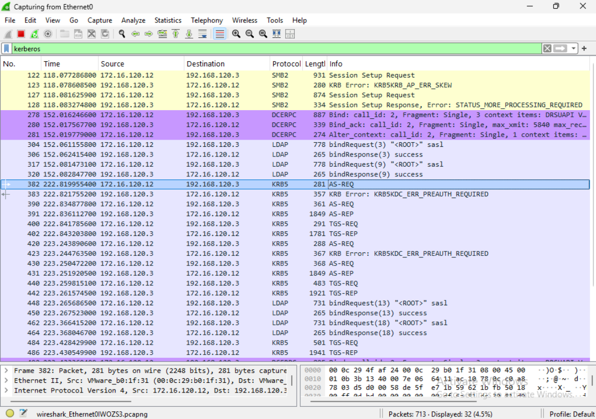

## Analyze the Authentication Service (AS) Exchange

The Authentication Service (AS) exchange is the first stage of the Kerberos authentication process. Its purpose is to verify the user's identity and issue a **Ticket Granting Ticket (TGT)**.

The authentication process follows these steps:

1. The client sends an **AS-REQ** packet to the Key Distribution Center.
2. The Key Distribution Center requests pre-authentication if it is required.
3. The client sends a second **AS-REQ** containing the required pre-authentication information.
4. After validating the user's credentials, the Key Distribution Center returns an **AS-REP** packet.
5. The **AS-REP** contains the Ticket Granting Ticket (TGT), which the client stores in its local Kerberos ticket cache.

The Ticket Granting Ticket allows the authenticated user to request service tickets for network resources without transmitting the user's password again.

## Analyze the AS-REQ Packet

The initial **AS-REQ** packet was sent from the Windows 11 client to the Domain Controller over Kerberos (TCP port 88). The packet contains information identifying the client, the requested Kerberos service, supported encryption algorithms, and additional values required for the authentication process.

**Figure 38.** Initial AS-REQ packet.

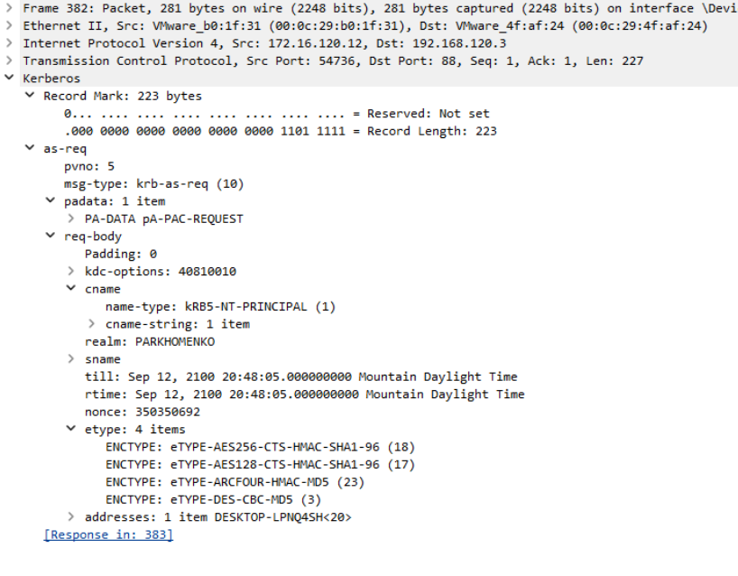

### CNameString

The AS-REQ packet contains the following client principal:

```text
CNameString: oparkhomenko
```

The **CNameString (Client Name String)** identifies the Kerberos principal requesting authentication. In this capture, the client principal is the Active Directory domain user **oparkhomenko**.

### Realm

The AS-REQ packet contains:

```text
Realm: PARKHOMENKO
```

The **Realm** identifies the Kerberos authentication domain responsible for processing the request.

In the initial AS-REQ packet, Wireshark displays the short Windows (NetBIOS) domain name **PARKHOMENKO**. Later in the authentication process, the AS-REP packet contains the full Kerberos realm **PARKHOMENKO.TEST**.

### SNameString

The requested service is shown as:

```text
SNameString: krbtgt
SNameString: PARKHOMENKO
```

The **SNameString (Service Name String)** identifies the Kerberos service requested by the client.

The value **krbtgt** indicates that the client is requesting a **Ticket Granting Ticket (TGT)** from the Kerberos Ticket Granting Service rather than requesting access to a specific network service.

**Figure 39.** Client principal, realm, and requested Kerberos service.

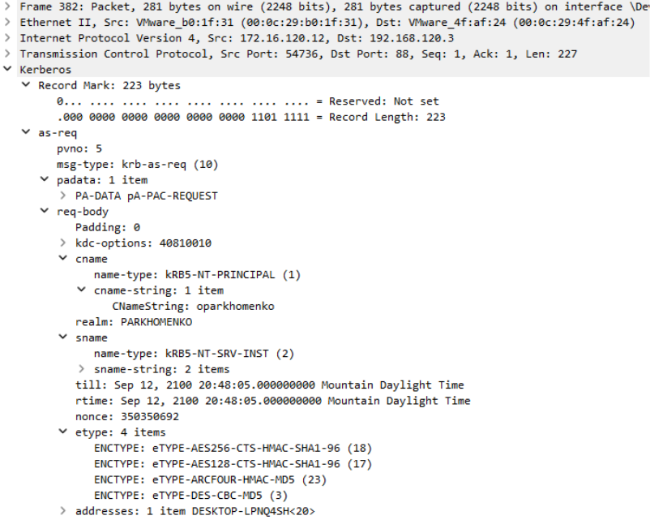

### Nonce

The AS-REQ packet contains the following nonce value:

```text
Nonce: 350350692
```

A **nonce** is a randomly generated number that uniquely identifies the authentication request. The Key Distribution Center returns this value in its response, allowing the client to verify that the reply corresponds to the original request and helping prevent replay attacks.

### Encryption Types (Etype)

The client advertises support for the following encryption types:

```text
AES256-CTS-HMAC-SHA1-96
AES128-CTS-HMAC-SHA1-96
ARCFOUR-HMAC-MD5
DES-CBC-MD5
```

The **encryption type (etype)** specifies the cryptographic algorithms supported by the client. The Key Distribution Center selects one of the mutually supported algorithms when generating encrypted Kerberos data. In this laboratory, the AS-REP later confirms that **AES256-CTS-HMAC-SHA1-96** was selected.

### NetBIOS Name

The short Windows domain name displayed in the AS-REQ packet is:

```text
PARKHOMENKO
```

This value represents the **NetBIOS domain name**, while the full DNS domain name used by Active Directory is **PARKHOMENKO.TEST**.

**Figure 40.** Expanded AS-REQ fields showing the client name, realm, service name, nonce, and supported encryption types.

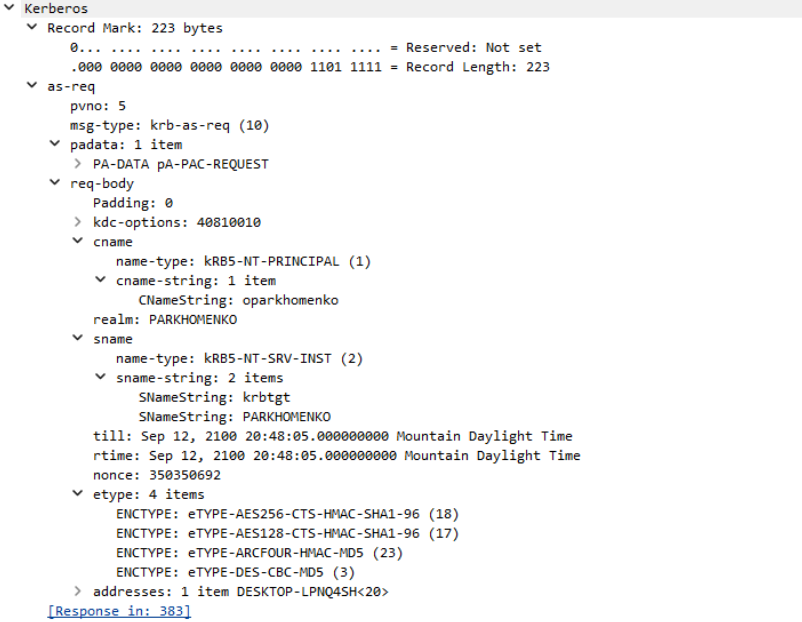

## Pre-Authentication Required

After receiving the initial `AS-REQ`, the Domain Controller responded with the following Kerberos message:

```text
KRB5KDC_ERR_PREAUTH_REQUIRED
```

Although Wireshark displays this as an error, it represents normal Kerberos behavior in Microsoft Active Directory rather than a failed authentication attempt.

The response informs the client that additional pre-authentication data must be included before the Key Distribution Center (KDC) will issue a Ticket Granting Ticket (TGT). The Windows client automatically generates the required pre-authentication information and immediately sends a second `AS-REQ`.

The response also provides information about the supported encryption types and the Kerberos salt used to derive the user's encryption key.

**Figure 41.** `KRB5KDC_ERR_PREAUTH_REQUIRED` response returned by the Key Distribution Center.

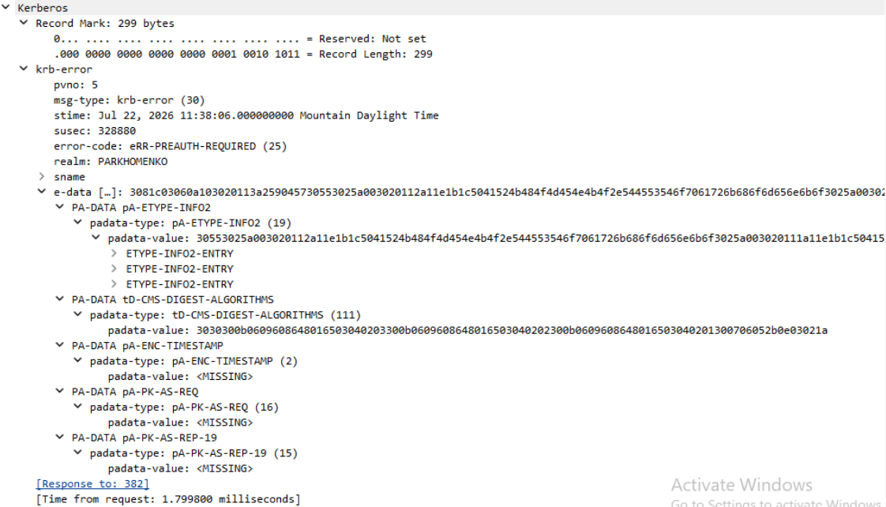

### Salt

The `PA-ETYPE-INFO2` structure contains the following salt value:

```text
PARKHOMENKO.TESToparkhomenko
```

The **salt** is combined with the user's password when deriving the Kerberos encryption key. Using a unique salt helps protect against precomputed attacks by ensuring that identical passwords produce different cryptographic keys for different users or Kerberos realms.

## Analyze the AS-REP Packet

After receiving the second `AS-REQ` containing valid pre-authentication data, the Key Distribution Center successfully authenticated the user and returned an `AS-REP` packet.

The `AS-REP` contains the Ticket Granting Ticket (TGT) together with the encrypted session key that will be used during subsequent Kerberos communications.

**Figure 42.** AS-REP packet returned by the Key Distribution Center.

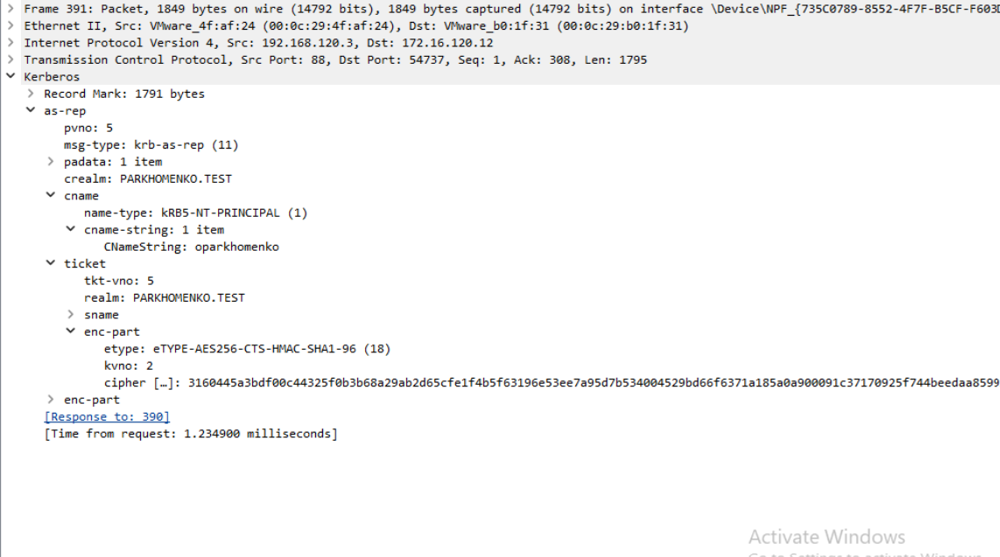

The packet contains the following information.

### Client Name

```text
cname: oparkhomenko
```

The **Client Name** identifies the authenticated Active Directory user account. The value matches the domain user that initiated the Kerberos authentication process.

### Kerberos Realm

```text
crealm: PARKHOMENKO.TEST
```

Unlike the initial `AS-REQ`, which displays the short Windows domain name, the `AS-REP` contains the full Kerberos realm corresponding to the Active Directory DNS domain.

### Ticket Realm

```text
realm: PARKHOMENKO.TEST
```

The **ticket realm** identifies the Kerberos realm that issued the Ticket Granting Ticket.

### Cipher

The encrypted portion of the response contains the following field:

```text
cipher
```

The **cipher** field contains the encrypted portion of the Kerberos message. Only the intended recipient possessing the appropriate cryptographic key can decrypt its contents. The encrypted data includes the session key and additional authentication information required for future Kerberos exchanges.

### Encryption Type

The `AS-REP` confirms that the following encryption algorithm was selected:

```text
AES256-CTS-HMAC-SHA1-96
```

This encryption type was selected because it is supported by both the client and the Key Distribution Center. AES256 is the strongest encryption algorithm offered by the client in this laboratory.

## Analyze the Ticket Granting Service (TGS) Exchange

After obtaining a valid Ticket Granting Ticket, the Windows client immediately requested a service ticket from the Key Distribution Center.

This second phase of Kerberos authentication is known as the **Ticket Granting Service (TGS) Exchange**.

Unlike the Authentication Service exchange, the user is **not authenticated again**. Instead, the client presents the previously issued Ticket Granting Ticket and requests access to a specific network service.

The packet capture includes the following messages:

- `TGS-REQ`
- `TGS-REP`

**Figure 43.** Ticket Granting Service exchange.

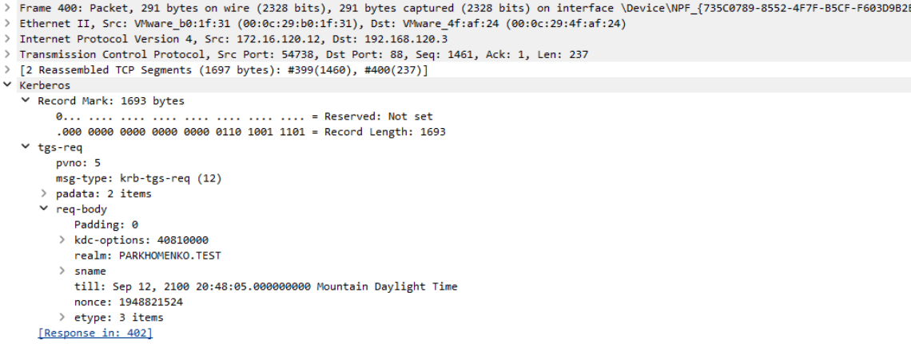

## Purpose of TGS Packets

The purpose of the Ticket Granting Service exchange is to obtain a **service ticket** for a specific network service.

Instead of requesting another Ticket Granting Ticket, the client presents its existing TGT to the Key Distribution Center and requests access to the required service.

If the request is successfully validated, the Key Distribution Center returns a `TGS-REP` containing the requested service ticket. The client subsequently presents this service ticket directly to the destination service without transmitting the user's password again.

## Analyze the TGS-REQ Packet

The captured `TGS-REQ` requests access to the following service:

```text
host
desktop-lpnq4sh.parkhomenko.test
```

The **Service Principal Name (SPN)** identifies the destination service for which the client is requesting a service ticket. In this laboratory, the service ticket is requested for the computer **desktop-lpnq4sh.parkhomenko.test**.

**Figure 44.** Service Principal Name contained in the `TGS-REQ` packet.

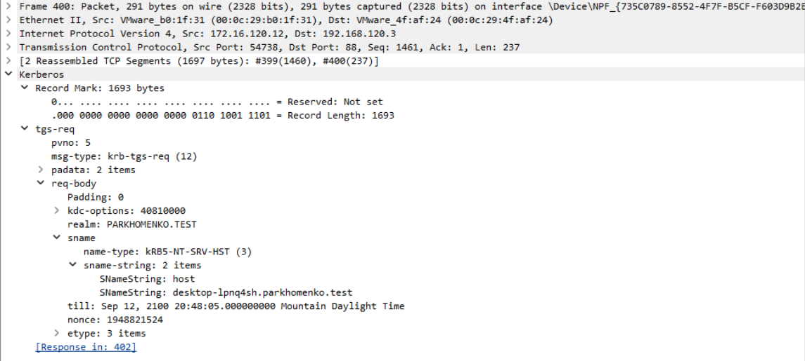

## Analyze LDAP Authentication

After the Kerberos authentication process completed successfully, the Windows 11 client communicated with Active Directory using the Lightweight Directory Access Protocol (LDAP).

The packet capture contains both an LDAP `bindRequest` and a successful `bindResponse`, confirming that the client established an authenticated LDAP session with the Domain Controller.

**Figure 45.** LDAP authentication packets captured after successful Kerberos authentication.

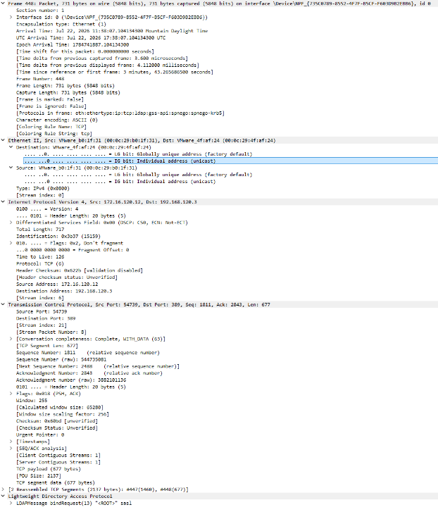

### LDAP bindRequest

The **bindRequest** packet is sent by the client to initiate an LDAP session with the Domain Controller.

The packet identifies the client and specifies the authentication mechanism that will be used. In this laboratory, the client uses **SASL (Simple Authentication and Security Layer)**, allowing LDAP to authenticate the client using the existing Kerberos security context established during the Kerberos authentication process.

Because the client has already obtained valid Kerberos tickets, LDAP does not require the user's password to be transmitted again.

### LDAP bindResponse

The **bindResponse** packet is returned by the Domain Controller after processing the client's authentication request.

The successful response confirms that the client's Kerberos credentials have been accepted and that the LDAP session has been established successfully.

Once the LDAP session is established, the Windows client can query Active Directory for directory information such as user accounts, groups, computer objects, security policies, and other domain resources.

## Verify Kerberos Tickets Using `klist`

After the Windows 11 client successfully authenticated to the Active Directory domain, the Kerberos ticket cache was examined using the following command:

```cmd
klist
```

The command displayed all Kerberos tickets currently stored in the user's ticket cache.

**Figure 47.** Kerberos tickets displayed using the `klist` command.

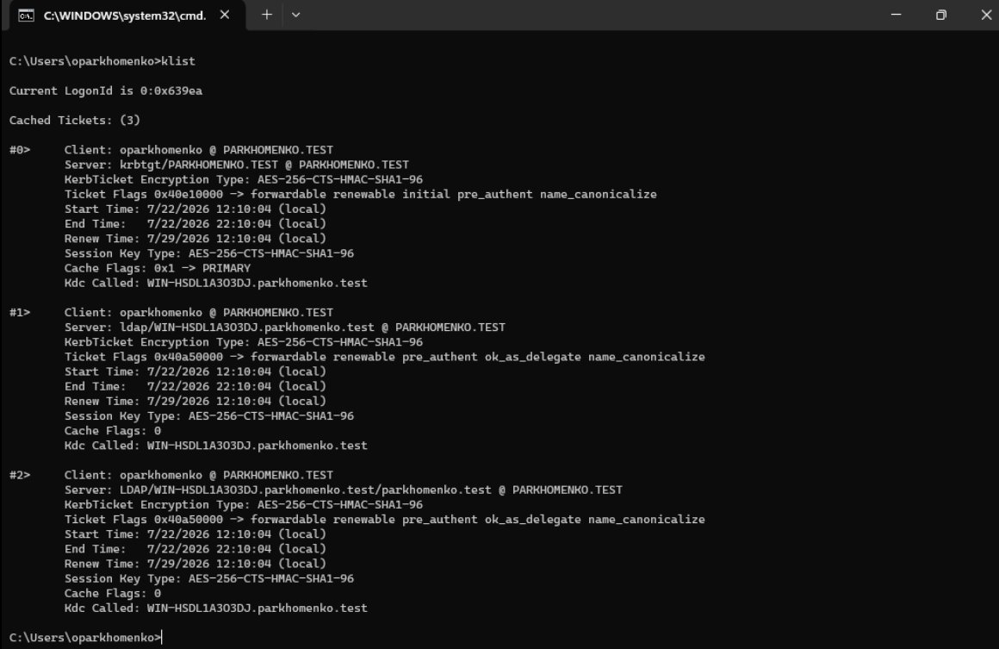

The ticket cache contains three Kerberos tickets.

| Ticket | Purpose |
| :--- | :--- |
| `krbtgt/PARKHOMENKO.TEST` | Ticket Granting Ticket (TGT) used to request service tickets from the Key Distribution Center. |
| `ldap/WIN-HSDL1A303DJ.parkhomenko.test` | Service ticket used to access the LDAP service on the Domain Controller. |
| `LDAP/WIN-HSDL1A303DJ.parkhomenko.test/parkhomenko.test` | Additional LDAP service ticket associated with the Active Directory domain. |

All three tickets use the **AES256-CTS-HMAC-SHA1-96** encryption algorithm, confirming that AES-256 was negotiated during Kerberos authentication.

## Explore the `krbtgt` Account

The built-in **krbtgt** account was examined using **Active Directory Users and Computers**.

The account is located in the **Users** container of the Active Directory domain.

**Figure 48.** Users container in Active Directory Users and Computers.

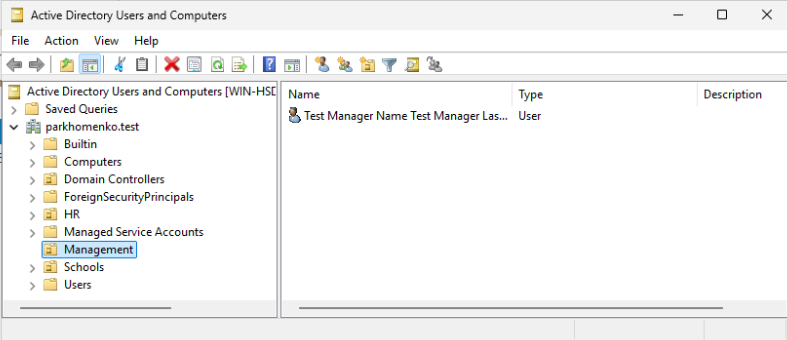

The `krbtgt` account was then located in the **Users** container and its properties were opened for examination.

**Figure 49.** Location of the built-in `krbtgt` account.

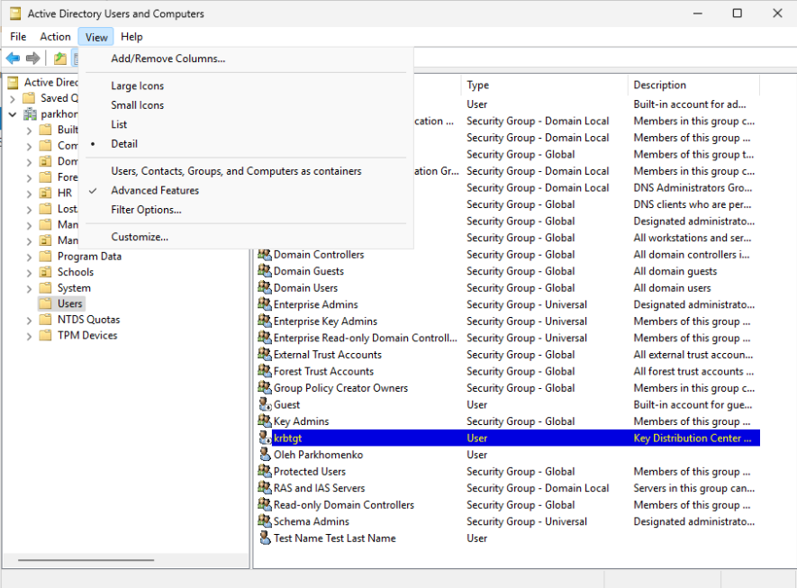

## Member Of

The **Member Of** tab shows that the account belongs to the following groups:

- `Domain Users`
- `Denied RODC Password Replication Group`

**Figure 50.** Group membership of the `krbtgt` account.

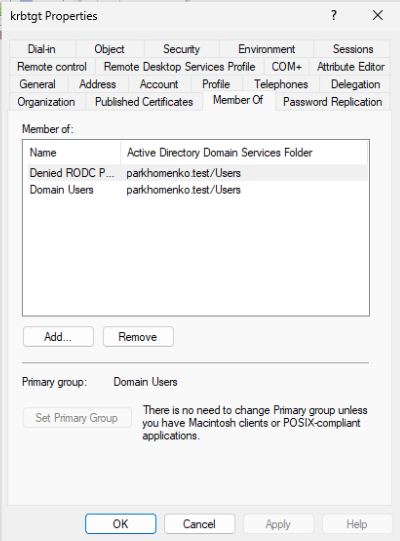

The **Domain Users** group is the default primary group for standard user accounts.

The **Denied RODC Password Replication Group** prevents the password hash of the `krbtgt` account from being replicated to Read-Only Domain Controllers (RODCs), helping protect one of the most sensitive accounts in the domain.

## Account

The **Account** tab contains the account name and logon configuration.

The following information was observed:

- User logon name: `krbtgt`
- Account never expires

**Figure 51.** Account properties of the `krbtgt` account.

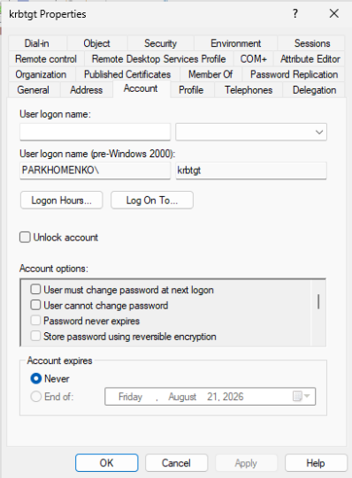

The account is a built-in Active Directory service account used internally by the Key Distribution Center (KDC). Unlike regular user accounts, it is not intended for interactive logon.

## Delegation

The **Delegation** tab contains the following configuration:

```text
Do not trust this user for delegation
```

**Figure 52.** Delegation settings of the `krbtgt` account.

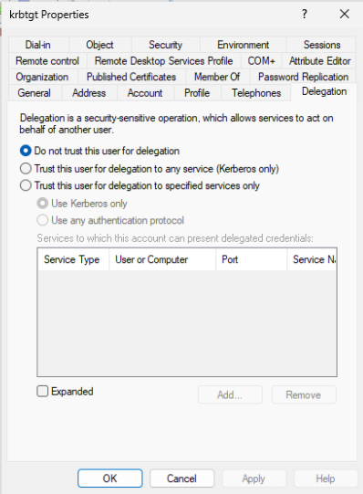

Delegation is disabled because the `krbtgt` account is reserved exclusively for Kerberos operations performed by the Key Distribution Center. It should never be used to impersonate users when accessing network services.

## Published Certificates

The **Published Certificates** tab was also examined.

No certificates were published for this account.

**Figure 53.** Published Certificates tab of the `krbtgt` account.

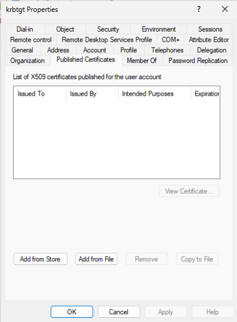

## Purpose of the `krbtgt` Account

The **krbtgt** account is a built-in Active Directory account used exclusively by the Kerberos Key Distribution Center (KDC).

Its primary function is to generate, encrypt, and sign **Ticket Granting Tickets (TGTs)** that are issued during the Authentication Service (AS) exchange.

When a user successfully authenticates, the KDC creates a Ticket Granting Ticket using the secret key associated with the `krbtgt` account. The client later presents this TGT during the Ticket Granting Service (TGS) exchange to request service tickets for individual network services.

Because every Kerberos authentication in the domain depends on the `krbtgt` account, it is one of the most important security accounts in an Active Directory environment.

## Summary

In this laboratory, the Kerberos authentication process in an Active Directory environment was successfully analyzed.

Wireshark was used to capture and examine the Authentication Service (AS) exchange, the Ticket Granting Service (TGS) exchange, and LDAP authentication traffic generated during a Windows 11 domain logon. The captured packets were analyzed to understand how Kerberos authenticates users, issues Ticket Granting Tickets, and grants access to network services.

The Kerberos ticket cache was verified using the `klist` command, confirming that the client received both a Ticket Granting Ticket and the required LDAP service tickets.

Finally, the built-in `krbtgt` account was examined in Active Directory Users and Computers to better understand its critical role in the Kerberos authentication infrastructure.